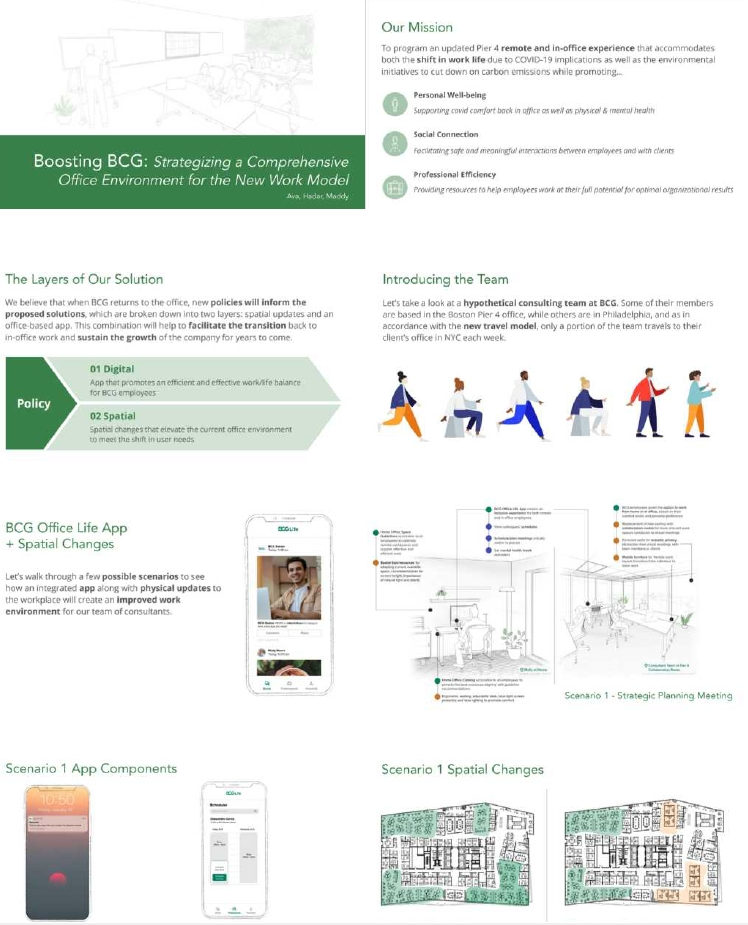

---
authors:
- admin

date: "2024-09-09T00:00:00Z"
draft: false
featured: false
image:
  # caption: 'Image credit: [**Unsplash**](https://unsplash.com/photos/CpkOjOcXdUY)'
  focal_point: ""
  placement: 2
  preview_only: false
lastmod: "2020-12-13T00:00:00Z"
projects: []
subtitle: "I have extensive experience in teaching design studios. This is a studio (DEA5540) that I have co-taught with my PhD advisor Ying Hua for four times. Students were required to apply research-based design for future working and learning environments from technological, physical, and social dimensions."
summary: "I have extensive experience in teaching design studios. This is a studio (DEA5540) that I have co-taught with my PhD advisor Ying Hua for four times. Students were required to apply research-based design for future working and learning environments from technological, physical, and social dimensions."

title: Future Learning Environments Design Studio
---

## Overview

1. **Structure and Goals**: **Design Skills**: strategic design to solve real world problems including research, design, communication with stakeholders, and collaboration in teams + **Integrated Environments**: systemetically design technological, physical, and social dimensions of learning and working environments
2. **Content and Curriculum**: Courses are organized by weekly desk crits with key points such as research and programming, strategic plan, midterm evaluation, integrated UX design (interior design, UI, service design), and final presentation.
3. **Examples of Students' works**
 
## Structure and Goals

- Outcome 1: Ability to apply concepts, techniques, and tools of strategic planning to address typical challenges facing large complex organizations
and projects.
- Outcome 2: Competency to develop innovative and well-grounded environments
planning, design, and management solutions for value generation, change
management, and branding.
- Outcome 3: Work in small teams as in a consulting project in real world; polish
skills for client communication and professional delivery of consulting work in
oral, visual and written forms.
This course was inspired from Ecological Systems Theory (Bronfenbrenner, 1990) to give students hands-on experience to design the integrated environments with multiple layers (Figure 1).

Figure 1: Ecological Systems Theory (Bronfenbrenner, 1990)  

## Content and Curriculum

The content of tasks were to design a real world learning or working environments based on stakeholders' high-level needs in real-world. The whole course includes weekly desk crits with key points such as research and programming, strategic plan, midterm evaluation, integrated UX design (interior design, UI, service design), and final presentation (Figure 2).

Figure 2: The course content

## Examples of Students' works
The final output is a portfolio usually having about 50 pages. Part of two examples were attached below.

Figure 3: Digital and Physical Solution for Future Workplace (by Ava and Hadar, 2022)

Figure 3: Metaverse Design for Future Office (by Yuling and Kevin, 2020) 

<!-- ## License

Copyright 2016-present [George Cushen](https://georgecushen.com).

Released under the [MIT](https://github.com/wowchemy/wowchemy-hugo-themes/blob/master/LICENSE.md) license. -->
