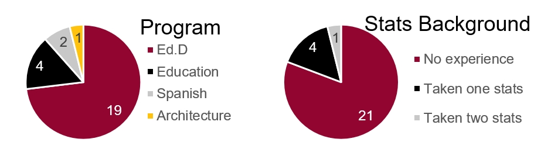
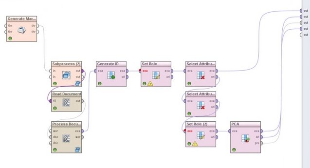
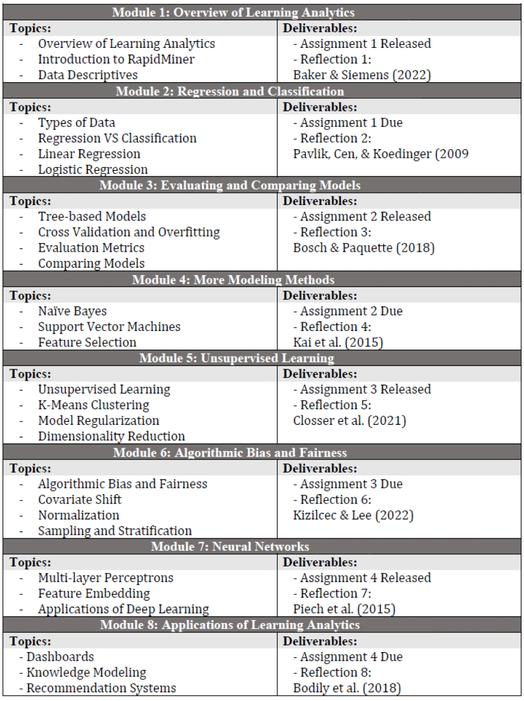

---
authors:
- admin

date: "2024-09-09T00:00:00Z"
draft: false
featured: false
image:
  # caption: 'Image credit: [**Unsplash**](https://unsplash.com/photos/CpkOjOcXdUY)'
  focal_point: ""
  placement: 2
  preview_only: false
lastmod: "2020-12-13T00:00:00Z"
projects: []
subtitle: "I have extensive experience in teaching computational design and representation: the instructor of record for ARC1911 Digital Representation at University of Pittsburgh; guest lecturer to teach AI for design representations at Cornell Unviersity twice and University of Florida; teaching assistant for four times for DEA 1101 Visual Literacy and Design Studio during my PhD."
summary: "I have extensive experience in teaching computational design and representation: the instructor of record for ARC1911 Digital Representation at University of Pittsburgh; guest lecturers to teach AI for design representations at Cornell Unviersity and University of Florida; teaching assistant for four times for DEA 1101 Visual Literacy and Design Studio during my PhD."

title: Data Driven Research Methods
---

## Overview

1. **Structure and Goals**: **Design Domain Knowledge** (Architecture/Industrial Design/System Design/Interior Design etc.) + **Software Skills** (AutoCAD, Illustrator, Photoshop, Fusion360, Rhino, Grasshopper, Revit, StableDiffusion etc.) + **Geometry Theory** (Architetural Geometry/Descriptive Gemotry/Computer Graphics/ Generative AI knowledge etc.)
2. **Content and Curriculum**: Courses are organized by tasks and assignments; Lectures and Practice. 
3. **AI Integration**: AI is a critical section in computational design and representation. I have successfully taught multiple workshops and one-month modules in departments of Interior Design, Architecture, Human-centered Design, Landscape Archtecture, Fashion Design at Cornell, University of Florida, and University of Pittsburgh.
4. **Links**: Links to examples of Syllabus, Miro Board, and slides.
 
## Structure and Goals

Courses are organized by tasks which cover geometry theories, design knowledge, and software skills. Figure 1 is an example of the structure of 2D vector fundamentals.

Figure 1: The course structure for module 1

## Content and Curriculum

The content of tasks are divided into several week-long sub-tasks. Students will learn by practicing. Figure 2 is an example of the content of 2D vector fundamentals.

Figure 2: The course content for module 1

In the class, interaction between instructors and students are critical. I used Miro board for requiring students to upload their screenshots at the end of the course, so I can understand their progress and adjust the content and speed in the following classes (Figure 3).

Figure 3: An example of Miro board progress

## AI Integration
I taught AI theories (transformer, finetuning), skills (prompt writing, workflow), applications (design settings) together and give students hands-on experience of using AI in their final projects. 
Figure 4 is an example of how AI may reverse the design workflow in Human-centered Design, a one-month module that I developed and taught at Cornell in Spring 2024.

Figure 4: Reversing design process by AI

## Links

I attached the syllabus, some Miro boards, and slides links here for reference:
- ARC1911 Syllabus (https://drive.google.com/file/d/1pf-0Z6aHyZFe-X-B1psDrMWo5PByLnRK/view)
- AI workshop Miro boards (https://miro.com/app/board/uXjVKU1-9zw=/)
- AI module slides (https://docs.google.com/presentation/d/1aGvU6jPsiaTuSKfoUPhFxxVj-TKsUIUbvZlge0kb14E/edit?usp=sharing)

<!-- ## License

Copyright 2016-present [George Cushen](https://georgecushen.com).

Released under the [MIT](https://github.com/wowchemy/wowchemy-hugo-themes/blob/master/LICENSE.md) license. -->
